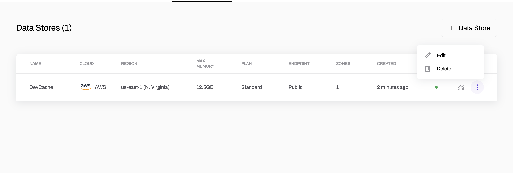

---
sidebar_position: 1
label: Cloud
--- 

## Getting Started with Dragonfly Cloud

A Dragonfly Cloud data store represents a Redis Protocol (RESP) endpoint. To create a data store, on the Data Store tab click +Data Store. The minimum configuration consists of a name, cloud provider, cloud region and plan. Note that the cloud provider can not be modified once the data store is created.

The plan specifies the provisioned memory and memory to cpu ratio of the data store. You can modify the data store plan later with zero down time to scale it up or down.

By default the data store will be configured with a public endpoint, TLS and an auto generated passkey, meaning you can securely connect to it from anywhere over the public internet.

To create a data store with a private endpoint, see [Security](./data-stores/security), [Networks](./networks) and Peering Connections.By default the data store will consist of a single Dragonfly server, to create a highly available data store see [Durability and High Availability](./data-stores/duarability-vs-high-availability)

Once the data store is created, clicking the data store row will open a drawer with the data store configuration, including the auto generated passkey and redis compatible connection string. 

Once the data store Status becomes `Active` you can try access it with e.g. `redis-cli -u [connection string] PING`.

To update the data store configuration click the edit button in the top right of the drawer. Dragonfly cloud performs data store updates with zero downtime.    

