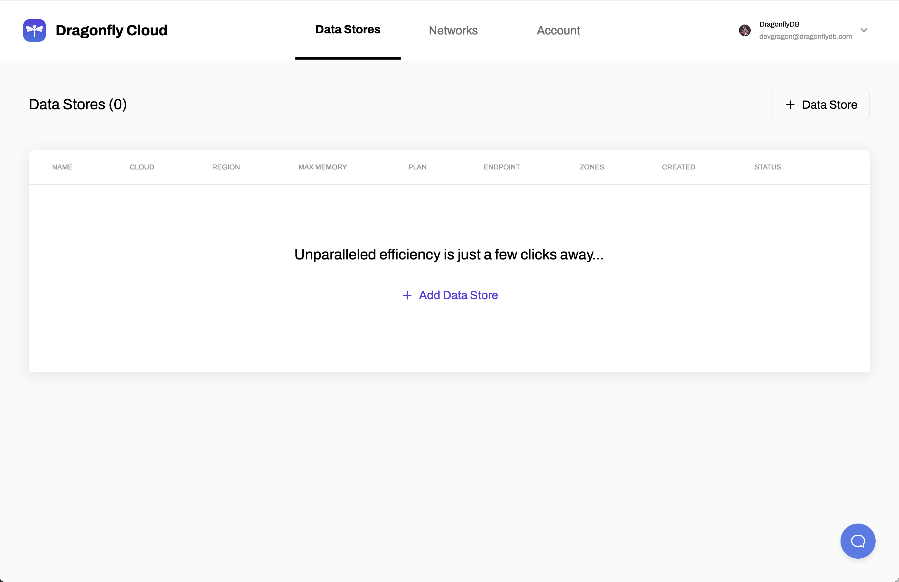

---
sidebar_position: 1
label: Cloud
--- 

## Getting Started with Dragonfly Cloud

Dragonfly Cloud brings the power of DragonFlyDB, to the cloud. Providing a fully managed experience with automated backups, scaling, and the ability to peer with your existing networks. DragonFly Cloud takes care of the heavy lifting, allowing you to ship faster, more reliable applications at significantly lower costs.

### **Get Started**

1. **Sign Up**

   Visit <a href="https://dragonflydb.cloud/signup">https://dragonflydb.cloud/signup</a> and sign up for a Dragonfly Cloud account using your email or Google account.

   

2. **Access the Data Stores Page**

   After signing up, you'll be redirected to the <a href="https://dragonflydb.cloud/datastores">Data Stores</a> page.

   

3. **Create Your First Data Store**

   From the Data Stores page, follow the instructions in the [Creating a Data Store](/cloud/data-stores/create-datastore) guide to create your first data store.

### Next Steps

**Pricing:**  See how our <a href="https://www.dragonflydb.io/pricing">pricing</a> plans fit your needs:

    

