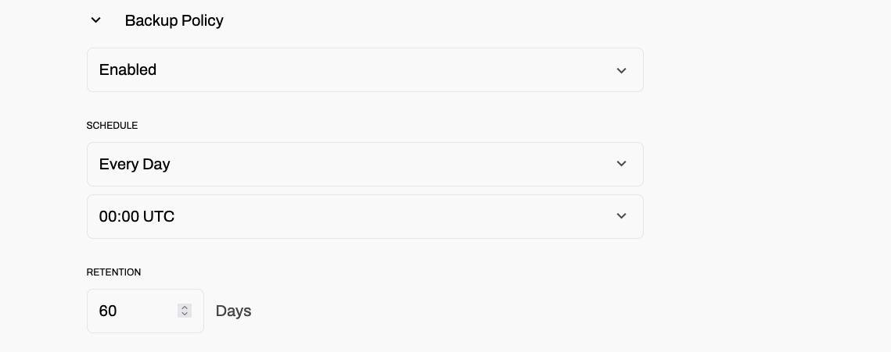

# Backups on Dragonfly cloud
Dragonfly Cloud offers automated backups for data protection and restoration.  However, backups **are not enabled by default**. When creating a data store, you can enable backups and configure the retention period.

## Enabling Backups

1. During the data store creation process, check the "Enable Backups" option.

2. Set the desired backup retention period:
 
 - By default, backups are retained for 30 days.
 - You can increase the retention period up to 60 days.

