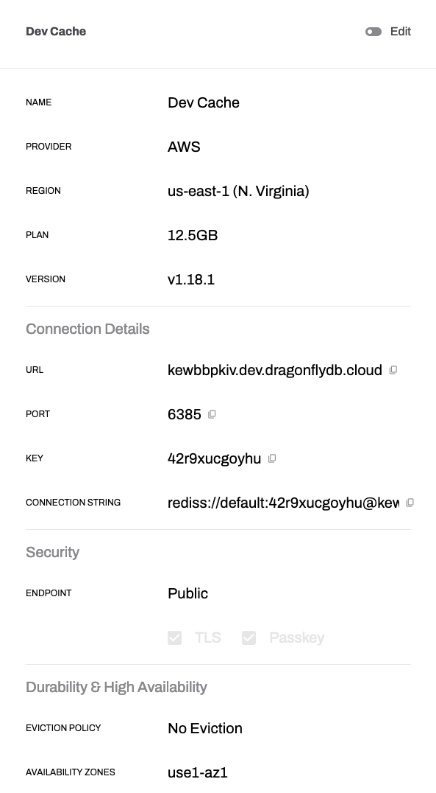

# View and Edit

After creating a data store, you can view and edit certain configurations to better suit your needs. To edit your data store:

1. Within the Data Stores tab, select the data store you wish to modify.
2. Click on the ellipsis menu (⋮) next to the data store, and choose "Edit."

On the Edit Data Store page, you can modify the following settings:

## Size

Adjust the size of your data store by specifying the desired amount of storage. This option allows you to scale your data store's capacity based on your application's requirements.

## Eviction Policy

Configure the eviction policy for your data store.

## Specializations

Enable or disable specializations like BullMQ for your data store. 

## Backups

Enable or disable automatic backups for your data store. 

After making the desired changes, click "Save" to apply the new configuration to your data store.

:::caution
Please note that modifying certain settings, such as increasing the data store size, may impact the pricing and incur additional costs. 
:::