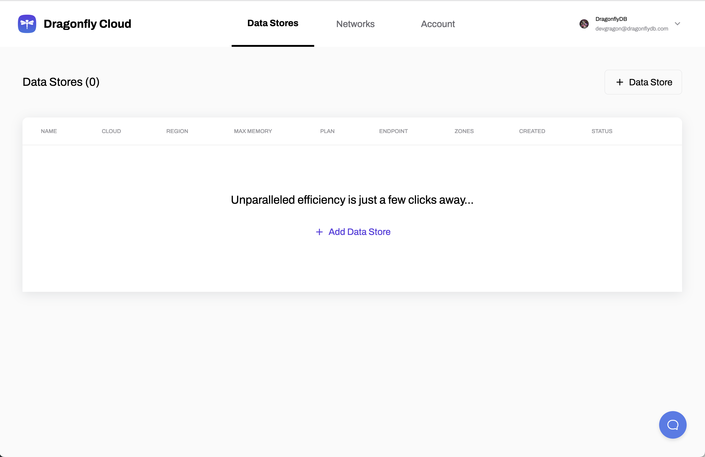
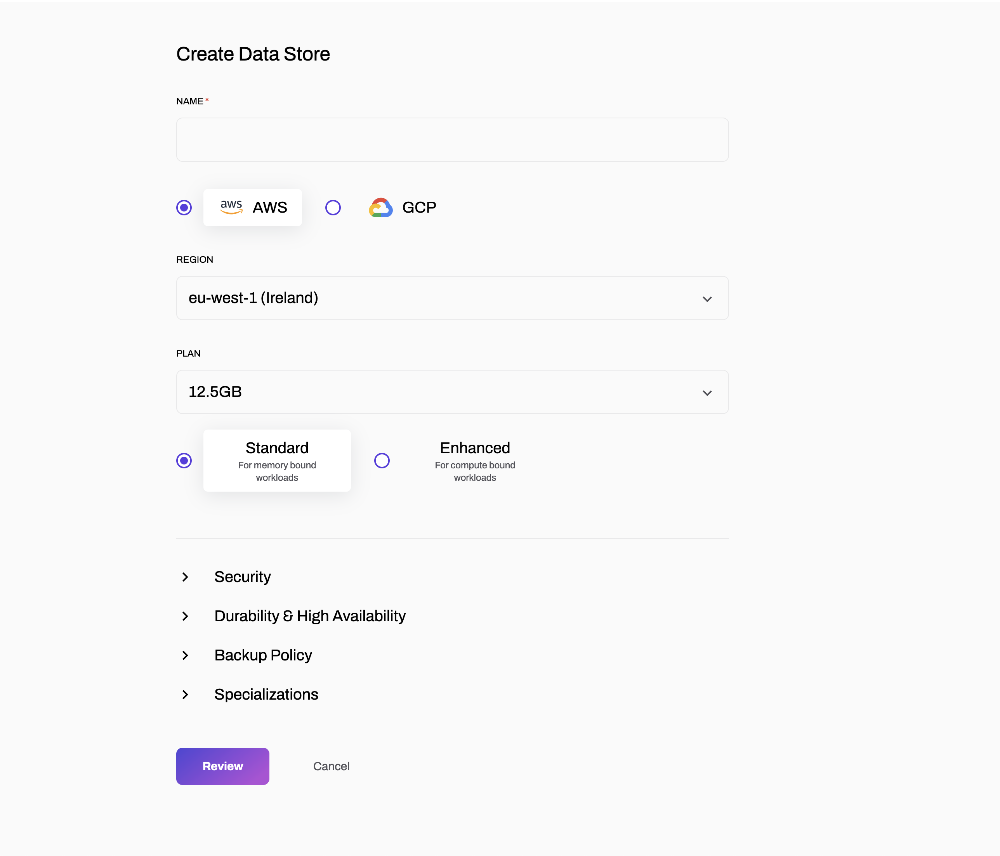

This guide outlines the steps to create a data store instance on DragonflyDB Cloud.

## Create a Data Store 

1. From the **Data Stores** menu, at the top right corner of the dashboard,  click **Data Store**

2. Fill out the "Create Data Store" form:

   - **Name:** Provide a name for your data store.
   - **Cloud Provider:**
     - **AWS:** Select this option to create your data store on Amazon Web Services.
     - **GCP:** Select this option to create your data store on Google Cloud Platform.
   - **Region:**
     - For AWS, select the region closest to your users.
     - For GCP, select the region closest to your users.

:::tip Tip
For the best performance, create your DragonFlyDB data store in the region closest to your users.
:::

   - **Plan:**
     - **Standard:** Choose this plan for memory-bound workloads.
     - **Enhanced:** Choose this plan for compute-bound workloads.

3. Review your configuration and click **Create Data Store** to initiate the deployment process.

:::note
You can click **Cancel** at any time to discard your changes.
:::

