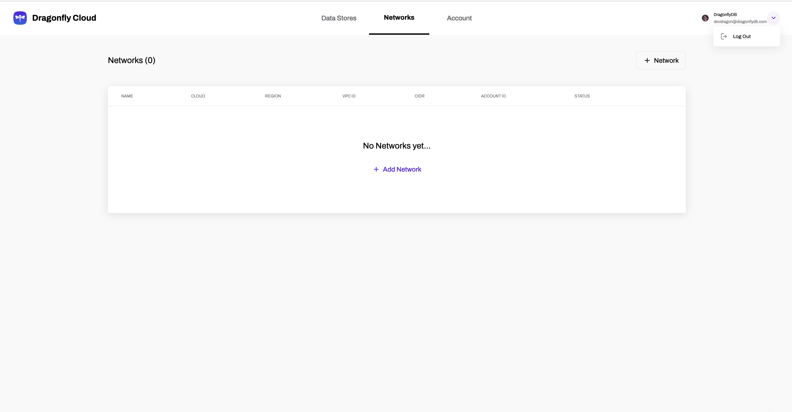
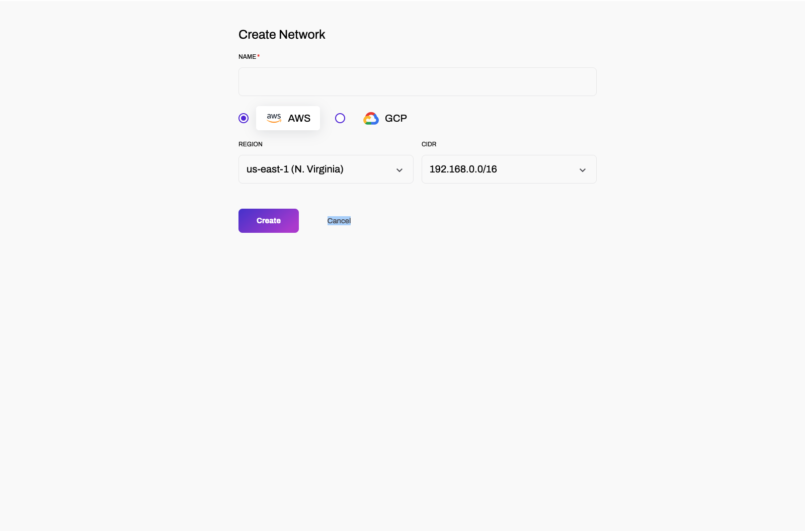

---
sidebar_postion: 2
--- 

## Managing Networks on Drangonfly Cloud

Dragonfly Cloud allows you to create isolated networks where you can deploy your data stores similar to VPC's if you are familiar with AWS. 

This guide outlines how you can create networks on Dragonfly Cloud.

:::note Prerequisites
You need an account before proceeding, create one -> dragonflydb.cloud/signup
:::

1. Navigate to the Networks tab. You can find it in the -> https://dragonflydb.cloud/networks

2. Fill out the "Create Network" form:

Create Network Form:

**Name**: Choose a unique and descriptive name for your network.
   
**Region**: Select the region where you want to create the network. Region availability depends on your cloud provider (AWS or GCP).

**CIDR**: Dragonfly Cloud supports custom CIDR blocks. Specify a CIDR block to tailor your network's address space to your specific needs. If left empty, Dragonfly Cloud will allocate a default CIDR.

:::tip Network Considerations
When creating a network, consider the following:
Choose a region close to your applications and users for better performance.
:::

3. Review your configuration and click **Create** to initiate the network creation process.

