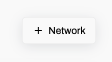

---
sidebar_position: 3
--- 

# Networks

Dragonfly Cloud allows you to create *private networks* for your data stores. After you create a private network you can:

 - Create a VPC *peering connection* to connect the Dragonfly Cloud private network with a VPC in your cloud account to establish communication between the two networks over private IP space. For more details see [Peering Connections](./connections).  

- Create a data store in the private network with a *private endpoint* For more details see [Data Store Security](./datastores#security).

*Note: By default each Dragonfly Cloud account has a quota of two private networks. If you need more private networks please contact support.* 

A private endpoint data store in a private network provides better security, performance and reduces data transfer costs.

To create a private network navigate to the *Networks* tab and click [+Network](https://dragonflydb.cloud/networks/new) at the top right corner.

<!--    -->

Specify your *cloud provider* and *cloud region*.

Specify the *CIDR* block (ip range) of the to be created dragonfly cloud network.
The CIDR of the dragonfly cloud network must not overlap with any CIDR of your application VPC from where you will be issuing requests.

For example the following CIDR pairs are overlapping:  

**192.168**.0.0/*16*, **192.168**.0.0/**16**  
**192.168**.0.0/*16*, **192.168.1**.0/**24**

While the following CIDR pairs are not overlapping:

**192.168**.0.0/**16**, **172.16**.0.0/**16**  
**192.168**.0.0/**16**, **172.16**.1.0/**24**

Once done click *Create* and observe the network status become *Active*.

See [Peering Connections](./connections.md) to connect the Dragonfly Cloud network to a VPC in your cloud account in order to establish communication between the two networks.